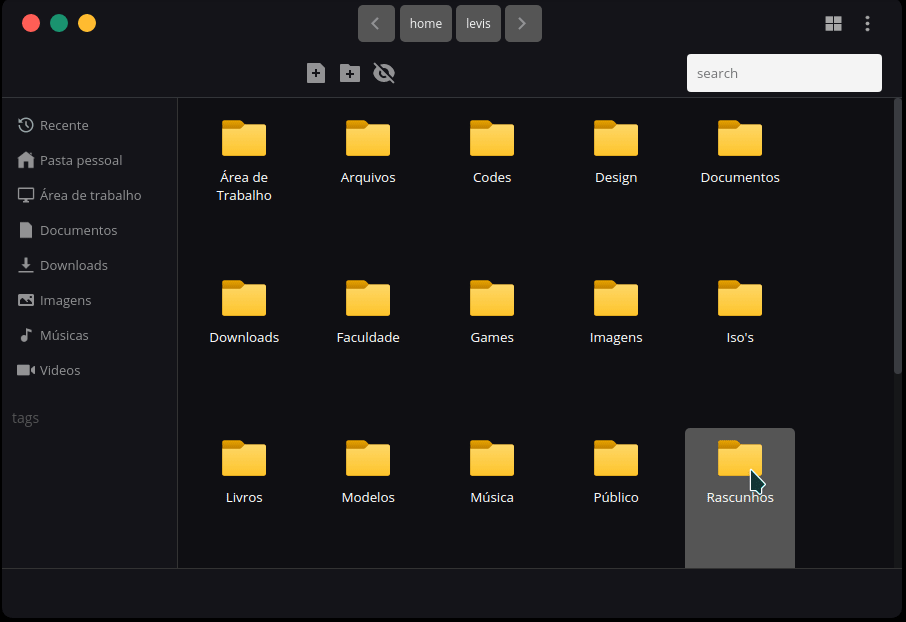

## 
File Manager in Electron 📂

---
## :pushpin: Descrição

 
Criando um gerenciador de arquivos utilizando o Electron.

----

## :page_facing_up: Requisitos

+ Node  _&nbsp;_ &GreaterEqual; _&nbsp;_ 12.9.1
+ npm _&nbsp;_ _&nbsp;_   &GreaterEqual; _&nbsp;_  6.10.2
----
## :robot: Tecnologias
+ Electron
+ HTML & CSS
+ JavaScript
+ Node 
--- 
## :rocket: Instalação
> _git clone https://github.com/levi5/electron-file-manager.git_

> _npm install_

## Autor
👤 <strong> Levi Araújo </strong>

---

## :pencil: Licença
Copyright © 2020 Levi Araújo.
This project is MIT licensed.
